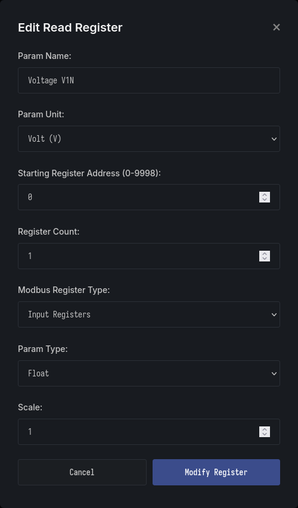
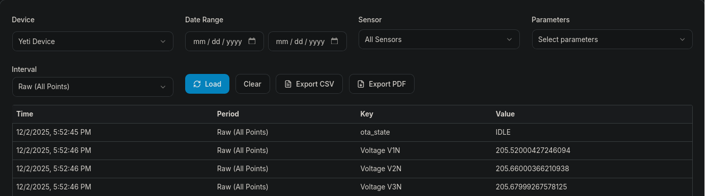
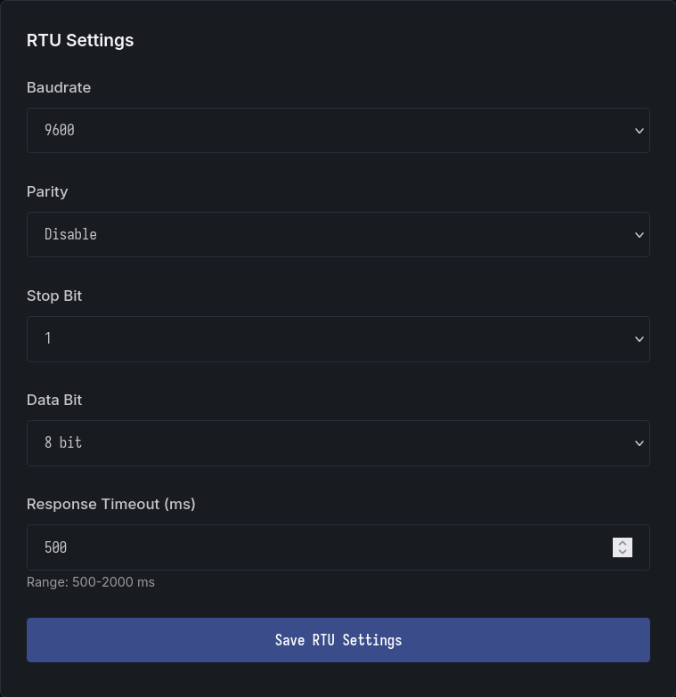
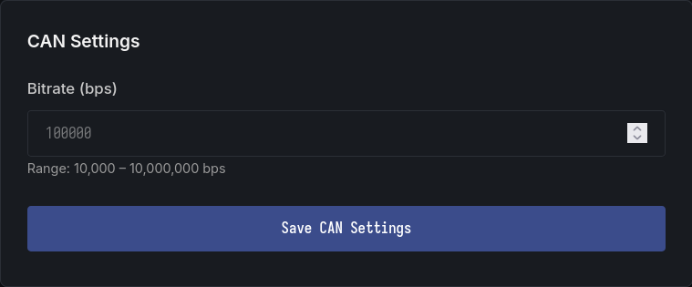

## Robust Modbus Communication

The Gateway supports RTU and TCP communication simultaneously, allowing integration of up to 16 devices. Users can perform both read and write operations directly from the web interface.

- **Multiple Modbus Support**  
   Add and manage up to 16 Modbus devices from a single view.
  

- **Device configuration**  
   Users can configure Modbus devices directly from the web portal, including parameters such as device ID, baud rate, function codes, and register mappings.
  

- **Modbus Read and Write Operation**  
   The interface supports both read and write operations for any connected device,
  

  
  
  

## Remote Monitoring

Yeti’s Application Server `https://www.garud.cloud` provides secure remote access to your device data, allowing users to monitor and analyze real-time information from anywhere.

- **Dashboard**  
  View live data from multiple devices simultaneously through a unified dashboard.
  

- **Graph**  
  Visualize trends and patterns with intuitive real-time graphs.
  

- **Report**  
  Generate detailed, timestamped reports for analysis, auditing, or record-keeping.
  

## Multi-Protocol Support:

The system integrates seamlessly with widely used industrial communication interfaces, ensuring compatibility across diverse equipment and environments. Supported protocols include RS-485, RS-232, and CAN.

- **Modbus Support**  
  Provides full support for RTU (wired) and TCP (wireless), enabling flexible deployment across legacy and modern networks.
  

  
  
  

- **RS-232 Support**  
  Offers reliable serial communication for devices using the RS-232 standard, commonly found in industrial controllers, sensors, and diagnostic equipment.
  

  
  

- **CAN Support**  
  Implements the CAN (Controller Area Network) protocol, widely used in automotive, industrial automation, and embedded systems for robust, high-integrity communication.
  

  
  

