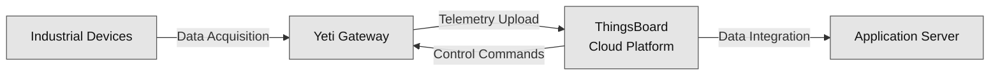
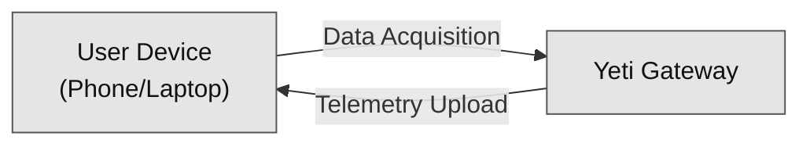

# System Architecture

The system operates through two primary workflows: **Data Flow** for normal operation and **Configuration Flow** for setup and maintenance.

### Data Flow

1. **Data Acquisition (Industrial Devices → Yeti Gateway):** The gateway actively polls and collects raw sensor data from connected industrial devices (e.g., Modbus) at configurable intervals.
2. **Telemetry Ingestion (Yeti Gateway → ThingsBoard):** The collected data is securely transmitted and ingested into the cloud platform using MQTTS (MQTT over TLS/SSL) for reliable and encrypted transport.
3. **Data Integration (ThingsBoard → Application Server):** The Application Server retrieves aggregated, processed, or real-time data from ThingsBoard using its secure REST API for deeper analysis, custom dashboards, and business logic execution.
4. **Control Commands (ThingsBoard → Yeti Gateway):** The cloud platform provides remote management capabilities, allowing for over-the-air (OTA) firmware updates, configuration changes, or sending direct control commands back to the gateway.

### Configuration Flow

1. **Local Connection (User Device → Yeti Gateway):** The user device (Phone/PC) establishes a temporary connection to the Yeti Gateway, typically via a local Wi-Fi Access Point (AP) mode or BLE, for initial setup.
2. **Parameter Configuration (User Device → Yeti Gateway):** The user transfers necessary setup parameters (e.g., cloud credentials, device connection strings, polling intervals) to the gateway before deployment.
