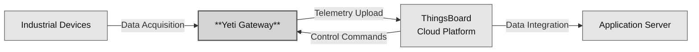
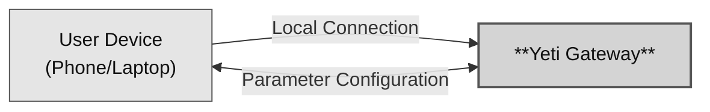

# System Architecture

The system operates through two primary workflows: **Data Flow** for normal operation and **Configuration Flow** for setup and maintenance.

### Data Flow

1. **Data Acquisition _(Industrial Devices -> Yeti Gateway)_**  
   The gateway polls connected industrial devices (e.g., Modbus) at configurable intervals and collects raw sensor data.

2. **Telemetry Ingestion _(Yeti Gateway -> ThingsBoard)_**  
   The gateway sends collected data to the cloud over MQTTS (MQTT over TLS/SSL), ensuring encrypted and reliable transmission.

3. **Data Integration _(ThingsBoard -> Application Server)_**  
   The Application Server retrieves real-time, aggregated, or processed data from ThingsBoard via its secure REST API for analytics, dashboards, and business logic.

4. **Control Commands _(ThingsBoard -> Yeti Gateway)_**  
   ThingsBoard enables remote management, including OTA firmware updates, configuration adjustments, and direct control commands sent back to the gateway.

### Configuration Flow

1. **Local Connection _(User Device -> Yeti Gateway)_**  
   The user device (phone or PC) temporarily connects to the Yeti Gateway—typically via a local Wi-Fi access point (AP mode) or BLE—to perform initial setup.

2. **Parameter Configuration _(Yeti Gateway <-> User Device)_**  
   The user sends required configuration parameters (e.g., cloud credentials, device connection strings, polling intervals) to the gateway before deployment.

